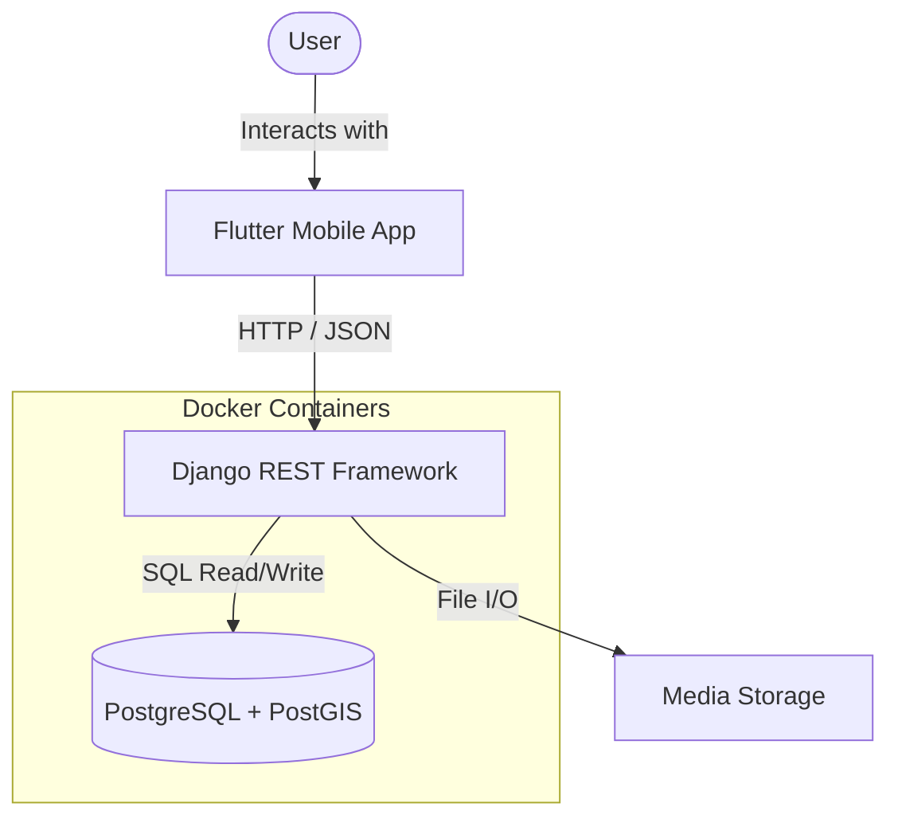

# Map My Friends

A personal geospatial application to track and visualize friends' locations in relation to each other. This project uses a "Batteries Included" approach with **GeoDjango** for complex spatial queries and **Flutter** for a cross-platform mobile experience, all orchestrated via **Docker**.

## ✨ Features

### Authentication & User Management
- **JWT Authentication** - Secure token-based auth with refresh tokens
- **User Registration** - Create new accounts with email verification
- **Password Reset** - Request and confirm password resets
- **User Profiles** - Profile picture upload and address management

### People Management
- **Contact CRUD** - Create, read, update, and delete contacts
- **Geolocation** - Store and display friend locations on a map
- **Tags** - Categorize contacts as Friends or Family
- **Rich Contact Info** - Name, address, birthday, phone number, profile image

### Map Visualization
- **Interactive Map** - View all contacts on an OSM-powered map
- **Location Pins** - See where your friends are located geographically

---

## 🚀 Tech Stack



### Backend (The Geo-Engine)
* **Framework:** Django 6.0 + Django REST Framework
* **Authentication:** Simple JWT (JSON Web Tokens)
* **Database:** PostgreSQL 16 + PostGIS (Geospatial extension)
* **Dependency Manager:** Poetry 2.0+
* **Infrastructure:** Docker & Docker Compose
* **Hosting Goal:** AWS (App Runner/ECS)

### Frontend (The Map)
* **Framework:** Flutter (iOS/Android/Desktop)
* **State Management:** BLoC Pattern
* **Networking:** Dio HTTP Client
* **Map Rendering:** `flutter_map` (Leaflet based)
* **Map Data:** OpenStreetMap (OSM)

---

## 🛠 Prerequisites

1.  **Docker Desktop:** Required to run the backend and database.
2.  **Flutter SDK:** Required for running the mobile app locally.
3.  **Git:** To clone the repo.

---

## ⚡️ Quick Start

### 1. Backend Setup (Docker)
The backend is fully containerized. You do **not** need to install Python, GDAL, or PostGIS on your local machine.

```bash
# 1. Clone the repo
git clone https://github.com/brandonlc2020/map-my-friends.git
cd map-my-friends

# 2. Build and Start the Containers
make up
# Or: docker compose up --build

# 3. Run database migrations
make mig
```

Once running:

* **API Root:** http://localhost:8000
* **Django Admin:** http://localhost:8000/admin

### 2. Frontend Setup (Flutter)

Open a **new terminal** tab (leave Docker running in the first one).

```bash
cd frontend

# 1. Install Dart dependencies
flutter pub get

# 2. Run the App (Select your Simulator/Emulator)
flutter run
```

---

## 🔌 API Endpoints

### Authentication (`/api/user/auth/`)
| Method | Endpoint | Description |
| --- | --- | --- |
| POST | `/api/user/auth/register/` | Register a new user |
| POST | `/api/user/auth/token/` | Obtain JWT token pair |
| POST | `/api/user/auth/token/refresh/` | Refresh access token |
| POST | `/api/user/auth/password-reset/` | Request password reset |
| POST | `/api/user/auth/password-reset/confirm/` | Confirm password reset |

### User Profile (`/api/user/`)
| Method | Endpoint | Description |
| --- | --- | --- |
| GET | `/api/user/profile/` | Get current user's profile |
| PATCH | `/api/user/profile/` | Update profile (supports image upload) |

### People (`/api/people/`)
| Method | Endpoint | Description |
| --- | --- | --- |
| GET | `/api/people/` | List all people |
| POST | `/api/people/` | Create a new person (auth required) |
| GET | `/api/people/{id}/` | Get person details |
| PUT | `/api/people/{id}/` | Update person (auth required) |
| DELETE | `/api/people/{id}/` | Delete person (auth required) |

---

## 🕹 Development Workflow & Commands

Since the backend runs inside a Docker container, you must execute commands *inside* the container.

### Using the Makefile (Recommended)

| Action | Command |
| --- | --- |
| **Start Server** | `make up` |
| **Stop Server** | `make down` |
| **Build Containers** | `make build` |
| **Run Migrations** | `make mig` |
| **Create Superuser** | `make user` |
| **Open Python Shell** | `make shell` |
| **Access Database** | `make db` |
| **Run Tests** | `make test` |
| **Install Dependencies** | `make install` |
| **Add Package** | `make add` |
| **Update Dependencies** | `make update` |

---

## 📂 Project Structure

```text
map-my-friends/
├── docker-compose.yml          # Orchestrates Django (api) and PostGIS (db)
├── Makefile                    # Shortcuts for Docker commands
│
├── backend/                    # Django Backend
│   ├── Dockerfile              # Python environment (w/ GDAL)
│   ├── pyproject.toml          # Poetry dependencies
│   ├── manage.py
│   ├── config/                 # Core Django settings & URLs
│   ├── apps/                   # Application modules
│   │   ├── people/             # Person model, views, serializers
│   │   └── users/              # User profiles, auth views
│   └── media/                  # Uploaded files (profile images)
│
└── frontend/                   # Flutter App
    └── lib/
        ├── main.dart           # App entry point
        ├── components/         # Reusable UI components
        ├── bloc/               # State management
        │   ├── auth/           # Authentication state
        │   ├── location/       # Location permissions
        │   ├── people/         # People list state
        │   └── profile/        # User profile state
        ├── models/             # Data models
        ├── screens/            # UI screens
        │   ├── auth/           # Login, Register, Forgot Password
        │   ├── map/            # Map visualization
        │   ├── people/         # People list, Add/Edit person
        │   └── profile/        # User profile (Me screen)
        └── services/           # API services & networking
```

---

## ⚠️ Important Notes

### Apple Silicon (M1/M2/M3) Users

You may see a warning in the Docker logs:

> *The requested image's platform (linux/amd64) does not match the detected host platform (linux/arm64/v8)...*

**This is normal.** The official PostGIS Docker image does not yet have a native ARM64 build. Docker uses Rosetta emulation to run the Intel image. It is stable for development purposes, just slightly slower on startup.

### Database Connection

* **Internal (Docker):** The Django app talks to the DB via the hostname `db`.
* **External (GUI):** Connect using DBeaver or TablePlus:
  * **Host:** `localhost`
  * **Port:** `5432`
  * **User:** `mapuser`
  * **Password:** `password`
  * **Database:** `mapfriends_db`
